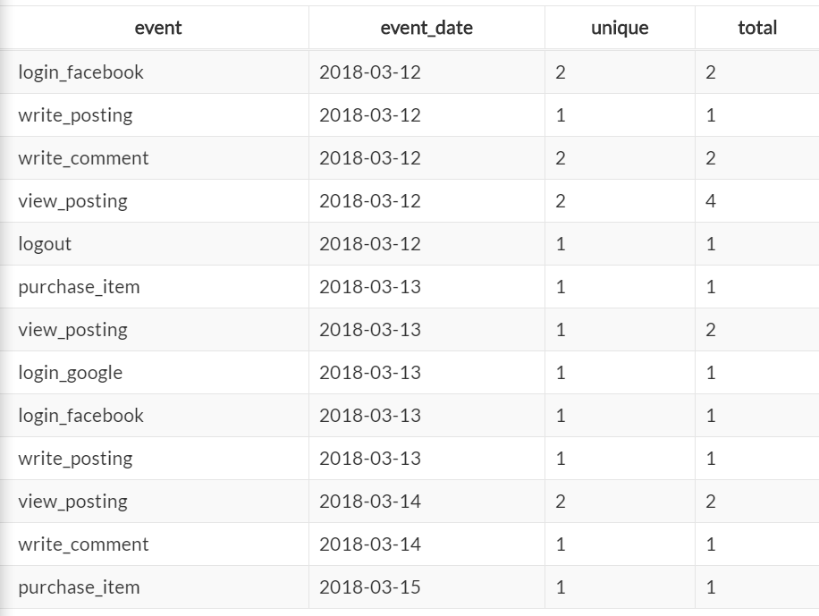

# SQL

```sql
SELECT [컬럼 이름]
FROM [테이블 이름]
WHERE [조건]
GROUP BY [그룹화할 컬럼]
HAVING [그룹화한 뒤 조건]
LIMIT [제한할 개수]
```

### SELECT / FROM

- 가장 중심이 되는 명령어

```sql
"서랍에 있는 연필을 찾고 싶은 경우"
SELECT 연필
FROM 서랍
```

- SELECT 뒤에는 찾고 싶은 목적 대상들(column)을 나열
- FROM 뒤에는 찾을 대상이 있는 공간(Table)을 작성

### WHERE

- 조건을 추가 하고싶은 경우

```sql
"서랍에 있는 연필 중 길이가 10cm 이상인 연필을 찾고 싶은 경우"
SELECT 연필
FROM 서랍
WHERE 길이 >= 10cm
```

- WHERE 뒤에는 조건을 주고 싶은 경우 작성

```sql
"서랍에 있는 연필 중 길이가 10cm 이상이고 색상이 빨간색인 연필을 찾고 싶은 경우"
SELECT 연필
FROM 서랍
WHERE 길이 >= 10 AND 색상 = "빨간색"
```

- WHERE 뒤에 조건의 순서를 어떻게 하냐에 따라서 결과가 나오는 속도가 다른 경우가 있다.
- 이는 인덱스와 관련이 있다.

### [실습](http://sqlfiddle.com/)을 해보자

- http://sqlfiddle.com/ 로 들어간다.
- 왼쪽 창에 아래의 예제를 붙여 넣고 Build Schema를 누른다

```sql
CREATE TABLE IF NOT EXISTS `user_log` (
  `index` INTEGER NOT NULL AUTO_INCREMENT,
  `user_id` VARCHAR(6) NOT NULL,
  `event` VARCHAR(200) NOT NULL,
  `event_date` date NOT NULL,
  PRIMARY KEY (`index`, `user_id`)
) DEFAULT CHARSET=utf8;
INSERT INTO `user_log` (`user_id`, `event`,`event_date`) VALUES
  ('1', 'login_facebook', '2018-03-12'),
  ('1', 'write_posting', '2018-03-12'),
  ('1', 'write_comment', '2018-03-12'),
  ('1', 'view_posting', '2018-03-12'),
  ('1', 'view_posting', '2018-03-12'),
  ('2', 'login_facebook', '2018-03-12'),
  ('2', 'view_posting', '2018-03-12'),
  ('2', 'view_posting', '2018-03-12'),
  ('2', 'write_comment', '2018-03-12'),
  ('2', 'logout', '2018-03-12'),
  ('2', 'login_facebook', '2018-03-13'),
  ('3', 'login_google', '2018-03-13'),
  ('3', 'write_posting', '2018-03-13'),
  ('3', 'view_posting', '2018-03-13'),
  ('3', 'view_posting', '2018-03-13'),
  ('3', 'purchase_item', '2018-03-15'),
  ('3', 'write_comment', '2018-03-14'),
  ('1', 'view_posting', '2018-03-14'),
  ('4', 'view_posting', '2018-03-14'),
  ('5', 'purchase_item', '2018-03-13');
```

- Table의 이름은 user_log
- Table에는 user_id, event, event_date가 기록되어 있다.

### '1'번 유저의 모든 이벤트 로그를 확인해보자

```sql
SELECT user_id, event, event_date
FROM user_log
WHERE user_id = '1';
```


### GROUP BY

- GROUP BY[컬럼 이름]으로 사용한다.
- 컬럼들을 그룹화 한다.


GROUP BY하기 위해 같은 값을 모아두고 그후에 연산(COUNT 혹은 SUM 같은 집계 함수)을 수행한다.

```sql
SELECT user_id, event, event_date, COUNT(DISTINCT user_id) AS 'unique', COUNT(user_id) AS 'total'
FROM user_log
WHERE user_id = '1'
GROUP BY user_id, event, event_date;
```

- COUNT
  - 개수를 COUNT한다.
  - COUNT(개수를 셀 컬럼) 이런식으로 사용한다
  - COUNT(user_id)를 하면 user_id의 갯수를 세준다
- DISTINCT
  - COUNT(DISTINCT user_id)를 하면 중복을 제외한 고유한 user_id의 개수를 세준다.
- AS 'unique'
  - 값을 센후 이름을 unique로 명시하겠다. 라는 뜻


아쉬운 점은 event_date기준으로 정렬되어 있지 않다. 이는 **ORDER** **BY**로 해결할 수 있다.

### ORDER BY

- ORDER BY [컬럼 이름] 으로 사용한다.
- 기본 옵션은 오름차순이다. 
- DESC를 붙여주면 내림차순으로 정렬된다.
- ORDER BY event_date DESC를 사용하면 최신 날짜부터 정렬 된다.

```sql
SELECT user_id, event, event_date, COUNT(DISTINCT user_id) AS 'unique', COUNT(user_id) AS 'total'
FROM user_log
WHERE user_id = '1'
GROUP BY user_id, event, event_date
ORDER BY event_date;
```


위 결과를 해석하면 1번 유저는 write_posting을 3월 12일에 1회 했고, view_posting을 2회 했습니다! WHERE 조건에 user_id를 1로 고정했기 때문에 unique값은 모두 1입니다. <u>만약 id를 제외하고</u> event, event_date만 뽑으면 어떻게 될까

```sql
SELECT event, event_date, COUNT(DISTINCT user_id) AS 'unique', COUNT(user_id) AS 'total'
FROM user_log
GROUP BY event, event_date
ORDER BY event_date;
```



특정 이벤트가 날짜별로 몇명이 했고 몇번 했는지를 알 수 있다.

## DAU 뽑기

- DAU란 : Daily Active User로 우리 서비스에서 어떤 이벤트라도 했던 사람을 Active로 정의하겠다.

```sql
SELECT event_date, COUNT(DISTINCT user_id) AS 'DAU'
FROM user_log
GROUP BY event_date
ORDER BY event_date;
```


### DAU가 2 이상인 날짜 뽑기

- GROUP BY를 통해 나온 값을 조건으로 걸고 싶은 경우
- **HAVING**을 사용한다.

### HAVING

- GROUP BY의 바로 아래에 작성한다.
- HAVING의 조건
  - 그룹화를 하기 전 컬럼에 대한 조건이라면 WHERE
  - 그룹화를 한 후의 컬럼에 대한 조건은 HAVING

### WHERE과 HAVING의 차이

- WHERE은 현재 Table에서 조건을 뽑아 내는것
- HAVING은 그룹화한 후 결과에서 조건을 뽑는 것
- 동시에 사용하는 경우도 있으나 HAVING은 주로 GROUP BY와 함께 쓰인다.

```
SELECT event_date, COUNT(DISTINCT user_id) AS 'DAU'
FROM user_log
GROUP BY event_date
HAVING DAU >= 2
ORDER BY event_date;
```


### LIMIT

- 보여줄 결과를 제한해주는 것
- 개수 제한이 필요한 경우 사용
- LIMIT [제한할 개수]

### JOIN

- 2개 이상의 Table을 조합해 새로운 가상 Table처럼 만들어 결과를 보여줄때 사용한다.
- 여러 Table을 연결한다고 생각하자

```sql
SELECT
FROM TABLE_A as a
LEFT JOIN
(SELECT
FROM TABLE_B) as b
ON a.column1 = b.column1
```

